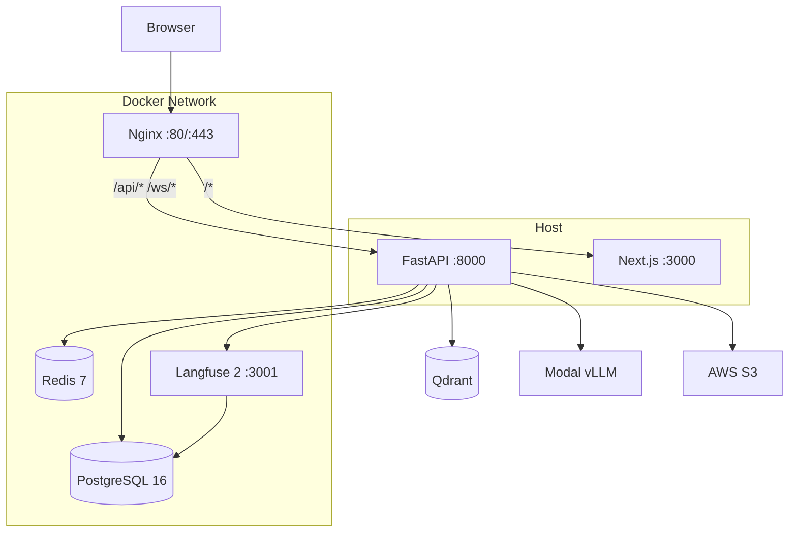
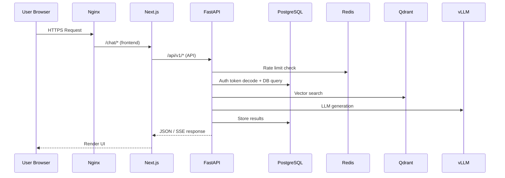
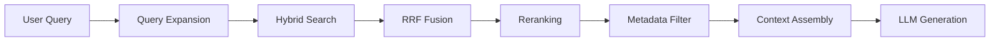
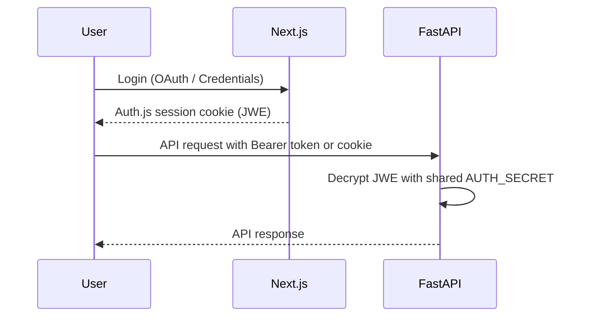
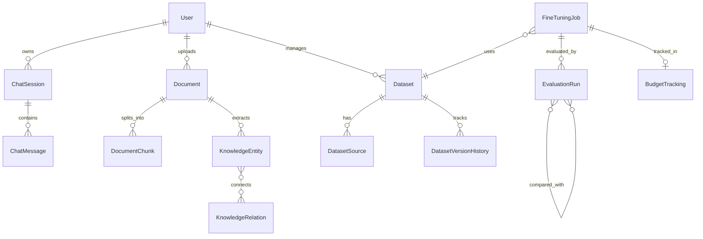
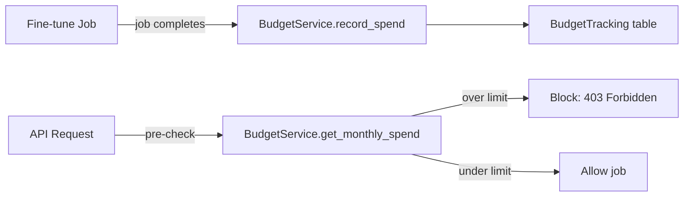
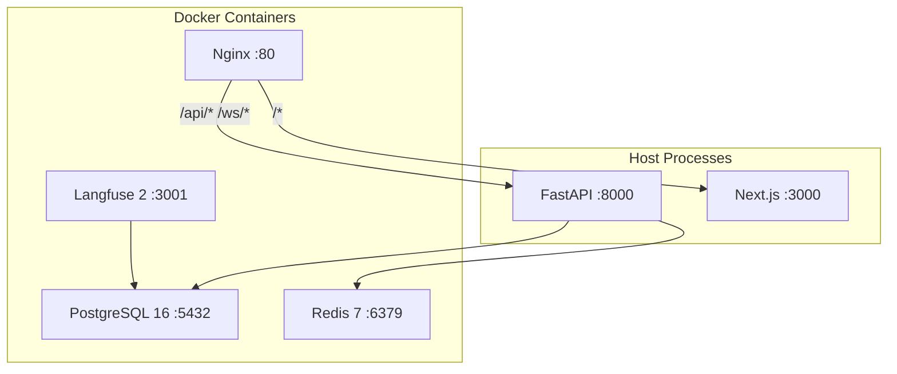
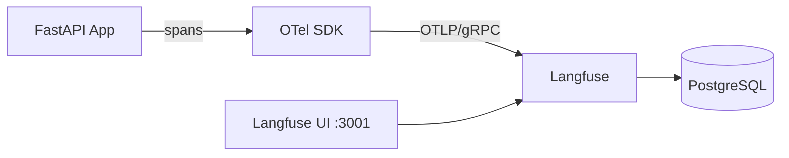

# IDKP Architecture Documentation

> Intelligent Domain Knowledge Platform — System Architecture

## Table of Contents

- [1. System Overview](#1-system-overview)
- [2. High-Level Architecture](#2-high-level-architecture)
- [3. Frontend (Next.js)](#3-frontend-nextjs)
- [4. Backend (FastAPI)](#4-backend-fastapi)
- [5. RAG Pipeline](#5-rag-pipeline)
- [6. Authentication & Authorization](#6-authentication--authorization)
- [7. Database Schema](#7-database-schema)
- [8. API Structure](#8-api-structure)
- [9. Evaluation & Benchmarking](#9-evaluation--benchmarking)
- [10. Budget & Rate Limiting](#10-budget--rate-limiting)
- [11. Infrastructure](#11-infrastructure)
- [12. Observability](#12-observability)

---

## 1. System Overview

IDKP is a full-stack platform for domain-specific knowledge management with RAG-powered chat, automated evaluation, and QLoRA fine-tuning. It follows a monorepo structure with three main components:

| Component | Technology | Port |
|-----------|-----------|------|
| Frontend | Next.js 15 (App Router) | 3000 |
| Backend | FastAPI (async) | 8000 |
| Infrastructure | Docker Compose | 80/443 (Nginx) |

**External services** (cloud-hosted or self-hosted):
- **PostgreSQL 16** — Primary database (document metadata, chat history, evaluation results)
- **Redis 7** — Rate limiting, caching, session store
- **Qdrant** — Vector database for semantic search
- **Langfuse 2** — Self-hosted LLM observability (shares PostgreSQL instance)
- **Modal vLLM** — Serverless GPU inference for LLM generation
- **AWS S3** — Document storage and model checkpoint persistence

---

## 2. High-Level Architecture



### Request Flow



---

## 3. Frontend (Next.js)

### Stack
- **Framework**: Next.js 15 with App Router
- **Styling**: Tailwind CSS + shadcn/ui components
- **Auth**: Auth.js v5 (NextAuth) with JWT strategy
- **Language**: TypeScript

### Route Structure
```
src/app/
  (auth)/
    login/page.tsx          — Login page
    layout.tsx              — Auth layout (no sidebar)
  (dashboard)/
    chat/page.tsx           — RAG chat interface
    datasets/page.tsx        — Dataset management
    models/page.tsx         — Model comparison dashboard
    layout.tsx              — Dashboard layout (sidebar)
  api/auth/[...nextauth]/route.ts — Auth.js API handler
  layout.tsx                — Root layout
  page.tsx                  — Landing/redirect
```

### Middleware
Next.js middleware (`src/middleware.ts`) protects dashboard routes. Unauthenticated users are redirected to `/login` with a `callbackUrl` query parameter. Auth API routes (`/api/auth/*`) are always allowed through.

### Key Frontend Files
| File | Purpose |
|------|---------|
| `src/lib/auth.ts` | Auth.js v5 config — Google, GitHub OAuth + Credentials provider |
| `src/middleware.ts` | Route protection via Auth.js `auth()` wrapper |
| `src/components/ui/*.tsx` | shadcn/ui components (button, card, dialog, input, sheet, etc.) |
| `src/components/layout/` | Dashboard sidebar, navigation |

---

## 4. Backend (FastAPI)

### Stack
- **Framework**: FastAPI with async support (Python 3.12+)
- **ORM**: SQLAlchemy 2.0 (async, `asyncpg` driver)
- **Migrations**: Alembic
- **Validation**: Pydantic v2
- **HTTP Client**: `httpx` (async)
- **Package Manager**: `uv`

### Project Structure
```
backend/
  app/
    main.py              — FastAPI app entry, CORS, rate limit middleware, lifespan
    config.py             — Settings (pydantic-settings) + MODEL_CATALOG
    dependencies.py       — get_current_user, get_db, get_db_context
    core/
      security.py         — JWE/JWT decode bridge for Auth.js v5 tokens
    middleware/
      rate_limit.py       — Per-user Redis sliding window rate limiting
    api/v1/
      router.py           — Central router (13 endpoint modules)
      endpoints/
        analytics.py       — Dashboard analytics & metrics
        auth.py            — Auth endpoints
        budget.py          — Budget summary
        chat.py            — RAG chat (SSE streaming)
        comparison.py      — A/B model comparison
        datasets.py        — Dataset CRUD
        documents.py       — Document upload, processing, management
        evaluation.py      — Evaluation runs, benchmarks
        fine_tune.py       — QLoRA fine-tuning jobs
        health.py          — Health check
        models.py          — Model catalog
        ws.py              — WebSocket endpoints
    db/
      base.py             — DeclarativeBase + TimestampMixin
      session.py           — Async engine + session factory
    models/                — 13 ORM models (SQLAlchemy 2.0)
    schemas/              — Pydantic request/response schemas
    services/              — Business logic layer
      rag/                 — RAG pipeline (12 modules)
        retriever.py       — Unified retrieval orchestrator
        vector_store.py    — Qdrant client
        embeddings.py      — BGE-M3 embedding generation
        llm_client.py      — vLLM OpenAI-compatible client
        prompt_builder.py  — RAG prompt construction
        hybrid_retriever.py — BM25 + dense fusion
        reranker.py        — BGE-Reranker cross-encoder
        query_expansion.py — HyDE + multi-query
        self_rag.py        — Self-RAG relevance gate
        context_assembler.py — Context dedup + compression
        citation_extractor.py — Post-generation citation extraction
      chat_service.py      — Chat session/message CRUD + RAG pipeline
      document_service.py  — Document upload/parse/chunk/embed lifecycle
      evaluation_service.py — RAGAS LLM-as-judge evaluation
      comparison_service.py — Model comparison (base vs finetuned)
      budget_service.py   — Monthly spend tracking + $30 hard limit
      document_parser.py   — PDF/DOCX/TXT/MD parsing
      document_chunker.py  — Text chunking with overlap
      agent_tool_wrapper.py — LangChain/LlamaIndex tool bridge
  alembic/                 — Database migrations
  tests/                   — Integration tests (pytest + async)
  conftest.py              — Test fixtures (in-memory SQLite, mock user)
```

### Dependency Injection
FastAPI dependencies in `dependencies.py`:

| Dependency | Purpose |
|-------------|---------|
| `get_current_user(request)` | Extracts `CurrentUser` from Auth.js JWE/JWT token (Authorization header or session cookie) |
| `get_db()` | Yields an async `AsyncSession` with auto-commit/rollback |
| `get_db_context()` | Async context manager for non-FastAPI contexts (WebSocket handlers) |

### ORM Models
All models extend `Base(DeclarativeBase)` and use `TimestampMixin` (auto `created_at`/`updated_at`). Primary keys are UUID4 strings.

| Model | Purpose |
|-------|---------|
| `User` | User accounts (mapped from Auth.js identities) |
| `Document` | Uploaded documents with processing status |
| `DocumentChunk` | Text chunks with content hash, token count, metadata |
| `KnowledgeEntity` | Extracted knowledge graph entities |
| `KnowledgeRelation` | Entity relationships |
| `ChatSession` | Chat conversations with model variant |
| `ChatMessage` | Individual messages with citations and latency |
| `Dataset` | Training datasets with version tracking |
| `DatasetSource` | Dataset source configuration |
| `DatasetVersionHistory` | Dataset version audit trail |
| `FineTuningJob` | QLoRA fine-tuning job records |
| `EvaluationRun` | RAGAS evaluation results (metrics + per-sample scores) |
| `BudgetTracking` | Monthly spending records |

---

## 5. RAG Pipeline

The advanced RAG pipeline in `services/rag/` implements a multi-stage retrieval and generation system. All components are individually toggleable via configuration.

### Pipeline Flow



### Components

| Component | Module | Description | Config Toggle |
|-----------|--------|-------------|---------------|
| Query Expansion | `query_expansion.py` | HyDE (hypothetical answer) + multi-query generation (3 variants) | `RAG_HYDE_ENABLED`, `RAG_MULTI_QUERY_ENABLED` |
| Hybrid Search | `hybrid_retriever.py` | Parallel BM25 (sparse) + dense vector search | `RAG_HYBRID_ENABLED` |
| RRF Fusion | `retriever.py` | Reciprocal Rank Fusion (k=60) merging BM25 + dense candidates | Enabled when hybrid is on |
| Cross-Encoder Reranking | `reranker.py` | BGE-Reranker-v2-m3 reranking | `RAG_RERANKER_ENABLED` |
| Metadata Filtering | `vector_store.py` | Qdrant payload filter support | `RAG_METADATA_FILTERS_ENABLED` |
| Self-RAG Gate | `self_rag.py` | Relevance scoring to filter irrelevant chunks | `RAG_RELEVANCE_GATE_ENABLED` |
| Context Assembly | `context_assembler.py` | Dedup (cosine > 0.95) + compression to fit token budget | Always active |
| Citation Extraction | `citation_extractor.py` | Post-generation citation extraction with accuracy scoring | Always active |

### Configuration Defaults
```python
# Embedding
EMBEDDING_MODEL = "BAAI/bge-m3"          # 1024-dim
EMBEDDING_DIMENSION = 1024

# Retrieval
RAG_TOP_K = 5
RAG_MIN_SCORE = 0.5
RAG_MAX_CONTEXT_TOKENS = 4096
RAG_BM25_TOP_K = 20
RAG_DENSE_TOP_K = 20
RAG_RERANKER_TOP_K = 5

# LLM
LLM_MODEL = "Qwen/Qwen2.5-7B-Instruct"
LLM_MAX_TOKENS = 1024
LLM_TEMPERATURE = 0.3
LLM_STREAM = True
```

### Chat Service Flow
The `chat_service.py` orchestrates the full chat pipeline:
1. Create/resume chat session
2. Store user message
3. Retrieve relevant chunks via advanced RAG pipeline
4. Assemble verified context (relevance gate + compression)
5. Stream LLM generation as SSE events (`token`, `citation`, `done`, `error`)
6. Extract post-generation citations
7. Store assistant message with citations and latency metrics

---

## 6. Authentication & Authorization

### Auth.js v5 + FastAPI JWT Bridge

The platform uses a shared-secret JWT bridge between Next.js (Auth.js v5) and FastAPI:



### Token Flow
1. User authenticates via Auth.js v5 (Google/GitHub OAuth or Credentials)
2. Auth.js issues a JWE-encrypted JWT (alg=dir, enc=A256GCM) signed with `AUTH_SECRET`
3. Token is stored as `next-auth.session-token` cookie or sent as `Authorization: Bearer <token>`
4. FastAPI's `get_current_user` dependency extracts the token from header or cookie
5. `security.py:decode_authjs_token()` decrypts JWE using SHA-256 derived key from `AUTH_SECRET`
6. Falls back to HS256 JWS verification if token is not encrypted
7. Returns `CurrentUser(user_id, email, name)` dataclass

### Frontend Middleware
Next.js middleware (`src/middleware.ts`) uses Auth.js `auth()` to protect all dashboard routes (`/chat`, `/datasets`, `/models`, `/`). Unauthenticated users are redirected to `/login`.

---

## 7. Database Schema

### Entity Relationships



### Key Design Decisions
- **UUID4 primary keys** — string-based for easy distribution and no ID guessing
- **JSON columns** — dialect-agnostic `JSON` type (not PostgreSQL-specific `JSONB`) for SQLite test compatibility
- **TimestampMixin** — automatic `created_at`/`updated_at` with PostgreSQL `now()` server default
- **Soft-status fields** — documents and jobs use status enums rather than soft deletes
- **Per-sample evaluation scores** — `EvaluationRun.per_sample_scores` stores detailed per-question metrics

---

## 8. API Structure

### Endpoint Modules (13 modules)

| Prefix | Module | Auth | Description |
|--------|--------|------|-------------|
| `/api/v1/health` | `health.py` | No | Health check (excluded from rate limiting) |
| `/api/v1/auth` | `auth.py` | No | Auth endpoints |
| `/api/v1/documents` | `documents.py` | Yes | Document CRUD, upload, processing |
| `/api/v1/chat` | `chat.py` | Yes | RAG chat (SSE streaming) |
| `/api/v1/datasets` | `datasets.py` | Yes | Dataset CRUD, versioning |
| `/api/v1/models` | `models.py` | Yes | Model catalog (8 models, 4 tiers) |
| `/api/v1/fine-tune` | `fine_tune.py` | Yes | QLoRA fine-tuning job management |
| `/api/v1/evaluations` | `evaluation.py` | Yes | Evaluation runs + benchmarks |
| `/api/v1/compare` | `comparison.py` | Yes | A/B model comparison |
| `/api/v1/budget` | `budget.py` | Yes | Monthly budget summary |
| `/api/v1/analytics` | `analytics.py` | Yes | Dashboard analytics & trends |
| `/api/v1/ws` | `ws.py` | Yes | WebSocket real-time updates |

### Response Patterns
- **Standard CRUD**: JSON responses with Pydantic schemas
- **Chat**: Server-Sent Events (SSE) stream with `token`, `citation`, `done`, `error` events
- **WebSocket**: Bidirectional real-time for job status updates
- **Error responses**: Standardized `{"detail": "...", "status_code": N}` with appropriate HTTP status codes

---

## 9. Evaluation & Benchmarking

### RAGAS-Compatible Metrics
The evaluation service (`evaluation_service.py`) implements LLM-as-judge scoring with four RAGAS-compatible metrics:

| Metric | What It Measures | Scale |
|--------|-----------------|-------|
| **Faithfulness** | Are answer claims grounded in retrieved context? | 0.0–1.0 |
| **Context Relevance** | Are retrieved chunks relevant to the question? | 0.0–1.0 |
| **Answer Relevance** | Does the answer address the question? | 0.0–1.0 |
| **Context Recall** | Does context cover the ground-truth answer? | 0.0–1.0 |

### Evaluation Types
| Type | Description | Trigger |
|------|-------------|--------|
| `baseline` | Evaluate base model on eval dataset | Manual / API |
| `post_training` | Evaluate fine-tuned model after job completes | Automatic |
| `comparison` | A/B comparison between two evaluation runs | Manual / API |
| `benchmark` | Multi-model benchmark (up to 5 models) | Manual / API |
| `weekly_regression` | Scheduled regression check | Cron / API |

### Model Comparison
The comparison service (`comparison_service.py`) runs the same query through both base and fine-tuned models, comparing:
- Response length and token count
- Generation latency
- Citation count
- RAGAS evaluation scores (when available)

---

## 10. Budget & Rate Limiting

### Budget Tracking
The budget service enforces a **$30/month hard limit** on GPU spending:



- Spend is recorded per fine-tuning job completion
- Monthly aggregation sums all `completed`/`running` status records
- Budget summary includes estimated remaining runs based on average cost
- Period resets on the 1st of each month (calendar month)

### Rate Limiting
Redis-backed sliding window rate limiting (TRD §9.2) with in-memory fallback:

| Endpoint Group | Limit | Window |
|---------------|-------|--------|
| `/api/v1/chat` | 60 req | 60s |
| `/api/v1/evaluations` | 20 req | 60s |
| `/api/v1/analytics` | 30 req | 60s |
| `/api/v1/fine-tune` | 10 req | 60s |
| Default (all other API) | 120 req | 60s |

**Implementation details**:
- Redis sorted sets (`ZADD`/`ZRANGEBYSCORE`) for sliding window
- Key format: `ratelimit:{user_id}:{path}`
- Falls back to in-memory counting when Redis is unavailable
- Rate limit headers: `X-RateLimit-Limit`, `X-RateLimit-Remaining`, `Retry-After`
- Health check and auth routes are excluded
- CORS preflight (OPTIONS) requests are skipped

---

## 11. Infrastructure

### Development Stack (`docker-compose.yml`)



| Service | Image | Purpose |
|---------|-------|---------|
| `postgres` | `postgres:16-alpine` | Primary DB + Langfuse DB (separate databases, shared instance) |
| `redis` | `redis:7-alpine` | Rate limiting, caching, session store (AOF persistence) |
| `langfuse` | `langfuse/langfuse:2` | LLM observability (depends on postgres health check) |
| `nginx` | `nginx:alpine` | Reverse proxy: `/api/*` + `/ws/*` → FastAPI, `/*` → Next.js |

The `scripts/init-db.sh` initialization script creates the separate `langfuse` database alongside the main `idkp` database on first container start.

### Production Stack (`docker-compose.prod.yml`)

Key differences from development:

| Aspect | Development | Production |
|--------|------------|------------|
| PostgreSQL | Default config | WAL archiving, tuned buffers (256MB shared, 1GB cache), slow query logging (>500ms) |
| Redis | Default AOF | Memory limit (512MB), LRU eviction, RDB snapshots |
| Nginx | HTTP only | SSL termination (Let's Encrypt), HSTS, security headers, gzip |
| Resource limits | None | CPU + memory limits per container |
| Logging | Default | JSON file driver with size/rotation limits |
| Restart policy | `unless-stopped` | `always` |
| Redis binding | `0.0.0.0` | `127.0.0.1` only (no external access) |
| Health checks | Basic | More conservative intervals and timeouts |

### Nginx Configuration
Development (`nginx/nginx.conf`):
- Routes `/api/*` and `/ws/*` to FastAPI backend
- Routes `/health` directly to backend for Docker health checks
- Routes `/*` to Next.js frontend
- WebSocket support (`Upgrade` header, HTTP/1.1)
- SSE/WebSocket: `proxy_buffering off`, 24h timeouts
- Next.js HMR WebSocket passthrough for development

### Model Catalog
8 models across 4 tiers (defined in `config.py:MODEL_CATALOG`):

| Tier | Models | GPU | Quality Range |
|------|--------|-----|---------------|
| T0 (Compact) | Qwen 2.5 7B, Gemma 4 E4B | A10G | 0.70–0.75 |
| T1 (Standard) | Qwen 2.5 14B, Ministral 3 14B, DeepSeek-R1 14B | A10G | 0.83–0.85 |
| T2 (Enhanced) | Qwen 2.5 32B, Gemma 4 31B | L40S | 0.90–0.92 |
| T3 (Maximum) | Qwen 2.5 72B, Llama 3.3 70B | A100-80GB | 0.95–0.96 |

### QLoRA Fine-Tuning Configuration
```python
QLORA_RANK = 64              # LoRA rank
QLORA_ALPHA = 128            # Alpha scaling factor
QLORA_DROPOUT = 0.05         # Dropout rate
QLORA_LEARNING_RATE = 2e-4   # Learning rate
QLORA_NUM_EPOCHS = 3         # Default epochs
QLORA_BATCH_SIZE = 4         # Per-device batch size
QLORA_GRAD_ACCUM_STEPS = 4   # Gradient accumulation
QLORA_MAX_SEQ_LENGTH = 2048  # Max sequence length
```

---

## 12. Observability

### OpenTelemetry + Langfuse

The backend integrates OpenTelemetry tracing with Langfuse as the trace backend:



**Implementation** (`main.py:_setup_observability()`):
- Lazy initialization — only activates when `LANGFUSE_PUBLIC_KEY` and `LANGFUSE_SECRET_KEY` are configured
- Uses `FastAPIInstrumentor` for automatic endpoint tracing
- Exports traces via OTLP/gRPC to Langfuse's public OTLP endpoint
- Resource attribute: `service.name=idkp-backend`
- Batch span processing for efficient export
- Graceful no-op when OpenTelemetry packages are not installed

### Configuration
```env
LANGFUSE_PUBLIC_KEY=pk-...
LANGFUSE_SECRET_KEY=sk-...
LANGFUSE_HOST=http://localhost:3001
```

When not configured, the system logs an info message and continues without tracing.

---

## Testing

### Test Infrastructure
- **Framework**: pytest with async support (`pytest-asyncio`)
- **Database**: In-memory SQLite for integration tests (no PostgreSQL required)
- **Fixtures**: `conftest.py` provides async test DB, mock user, and auth headers (HS256 JWT)
- **Location**: `backend/tests/`

### Test Files

| File | Tests | Lines |
|------|-------|-------|
| `test_health.py` | Health endpoint smoke test | 17 |
| `test_api_health_auth.py` | Health + auth endpoint tests | 103 |
| `test_validation.py` | Input validation tests | 218 |
| `test_api_documents.py` | Document endpoint tests | 58 |
| `test_api_datasets.py` | Dataset CRUD integration tests | 211 |
| `test_api_finetune_budget.py` | Fine-tuning + budget integration tests | 283 |
| `test_api_analytics.py` | Analytics + comparison endpoint tests | 226 |
| `test_api_evaluation.py` | Evaluation, benchmark, comparison tests | 342 |
| `test_security_prompt_injection.py` | Prompt injection security tests | 322 |
| `test_security_auth_isolation.py` | Auth isolation security tests | 306 |

### Load Testing
- `backend/tests/load/coldstart_locustfile.py` — Locust cold-start load test profile

